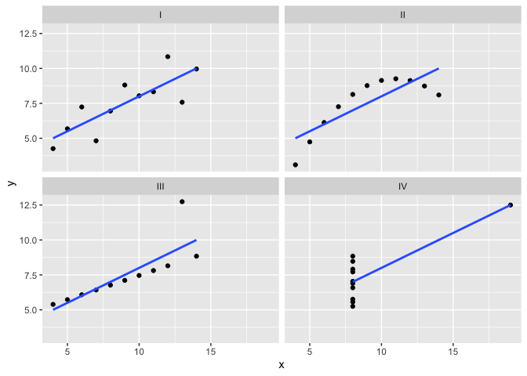

Closer look at data
================
Carlos Guadián
9/15/2021

## Puede parecer lo mismo, pero no lo es

Hay conjuntos de datos que pese a que tienen unas características
similares, tienen diferencias importantes en cuanto a su composición.

Para mostrar el ejemplo tomamos Anscombe Quartet. Instalamos y cargamos
el paquete Tmisc.

``` r
install.packages("Tmisc")
```

    ## 
    ## The downloaded binary packages are in
    ##  /var/folders/c6/hvwngrfn7bd1d8fflmlgn5380000gn/T//RtmpLq3Jdz/downloaded_packages

``` r
library(Tmisc)
```

Y cargamos y vemos los datos que queremos examinar.

``` r
data("quartet")
head(quartet)
```

    ##   set  x    y
    ## 1   I 10 8.04
    ## 2   I  8 6.95
    ## 3   I 13 7.58
    ## 4   I  9 8.81
    ## 5   I 11 8.33
    ## 6   I 14 9.96

Se puede apreciar que hay cuatro sets diferentes de datos. Vamos a pedir
unos datos estadísticos básicos de cada uno de ellos con summarize para
ver si hay diferencias entre ellos.

En los resultados tanto la media, la desviación estándar y la
correlación entre x e y son idénticas en todos los casos. Por lo tanto,
si nos basamos en el sumario estadístico, podríamos decir que los cuatro
grupos son iguales, en cuanto a datos se refiere.

``` r
library(dplyr)
```

    ## 
    ## Attaching package: 'dplyr'

    ## The following objects are masked from 'package:stats':
    ## 
    ##     filter, lag

    ## The following objects are masked from 'package:base':
    ## 
    ##     intersect, setdiff, setequal, union

``` r
quartet %>% 
  group_by(set) %>% 
  summarize(mean(x), sd(x), mean(y), sd(y), cor(x, y))
```

    ## # A tibble: 4 × 6
    ##   set   `mean(x)` `sd(x)` `mean(y)` `sd(y)` `cor(x, y)`
    ##   <fct>     <dbl>   <dbl>     <dbl>   <dbl>       <dbl>
    ## 1 I             9    3.32      7.50    2.03       0.816
    ## 2 II            9    3.32      7.50    2.03       0.816
    ## 3 III           9    3.32      7.5     2.03       0.816
    ## 4 IV            9    3.32      7.50    2.03       0.817

Pero si los visualizamos con un sencillo gráfico… Podemos ver que cada
uno de los sets es completamente diferente.

``` r
library(ggplot2)
ggplot(quartet, aes(x, y)) + geom_point() + geom_smooth(formula = y ~ x, method = lm, se = FALSE) +facet_wrap(~ set)
```

<!-- -->
