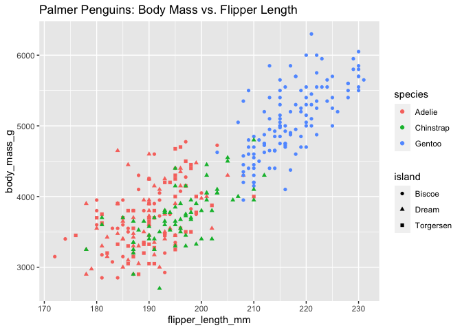
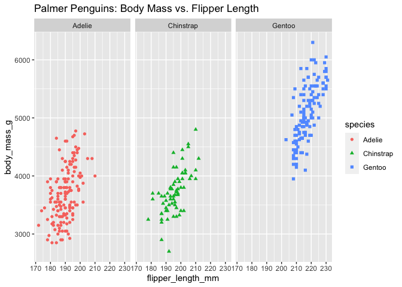

ggplot2 Basics
================
Carlos Guadián

## Basics

*ggplot2* se basa en la gramática de los gráficos, que es un sistema
para describir y construir visualizaciones de datos.

La idea esencial detrás de la gramática de los gráficos es que se puede
construir cualquier gráfico a partir de los mismos componentes básicos,
como bloques de construcción.

Estos bloques de construcción incluyen:

-   Un conjunto de datos
-   Un conjunto de geom: Un geom se refiere al objeto geométrico
    utilizado para representar sus datos. Por ejemplo, puede utilizar
    puntos para crear un gráfico de dispersión, barras para crear un
    gráfico de barras, líneas para crear un diagrama de líneas, etc.
-   Un conjunto de atributos estéticos: Una estética es una propiedad
    visual de un objeto en su gráfico. Puedes pensar en una estética
    como una conexión, o un mapeo, entre una característica visual en tu
    gráfico y una variable en tus datos. Por ejemplo, en un gráfico de
    dispersión, la estética incluye cosas como el tamaño, la forma, el
    color o la ubicación (eje x, eje y) de los puntos de datos.

Para crear un gráfico con ggplot2, primero se elige un conjunto de
datos. A continuación, se determina cómo organizar visualmente sus datos
en un sistema de coordenadas mediante la elección de un geom para
representar sus puntos de datos y la estética para trazar sus variables.

## Preparar los datos

Vamos a utilizar ggplot2 y los datos de Palmer Penguins, por lo tanto si
no están instalados hay que hacerlo. Si ya los enéis pasar al siguiente
punto.

``` r
install.packages("ggplot2")
```

    ## 
    ## The downloaded binary packages are in
    ##  /var/folders/c6/hvwngrfn7bd1d8fflmlgn5380000gn/T//RtmpfYYAS1/downloaded_packages

``` r
install.packages("palmerpenguins")
```

    ## 
    ## The downloaded binary packages are in
    ##  /var/folders/c6/hvwngrfn7bd1d8fflmlgn5380000gn/T//RtmpfYYAS1/downloaded_packages

Una vez instalados vamos a cargar ambos paquetes.

``` r
library("ggplot2")
library("palmerpenguins")
```

Primero vamos a examinar el paquete de datos de Palmer Penguins.

``` r
data("penguins")
View(penguins)
```

El conjunto de datos de pingüinos contiene medidas de tamaño de tres
especies de pingüinos (Adelia, Barbijo y Papúa) que viven en el
archipiélago de Palmer, en la Antártida. Las columnas incluyen
información como la masa corporal, la longitud de las aletas y la
longitud del pico.

## Crear un gráfico con ggplot2

Supongamos que queremos trazar la relación entre la masa corporal y la
longitud de las aletas en las tres especies de pingüinos.

Un gráfico de dispersión de puntos sería una forma eficaz de mostrar la
relación entre las dos variables.

Podemos poner la longitud de la aleta en el eje x y la masa corporal en
el eje y.

Para escribir la función utilizaremos los siguientes elementos:

-   ggplot(datos = penguins): El primer argumento de la función ggplot()
    es el conjunto de datos a utilizar en el gráfico. En este caso, es
    “penguins”.
-   +: A continuación, se añade un símbolo “+” para añadir una nueva
    capa a tu gráfico.
-   geom\_point(): La función geom\_point() utiliza puntos para crear
    gráficos de dispersión, la función geom\_bar utiliza barras para
    crear gráficos de barras, etc.
-   (mapping = aes(x = flipper\_length\_mm, y = body\_mass\_g)): El
    argumento de mapeo siempre está emparejado con la función aes(). Los
    argumentos x e y de la función aes() especifican qué variables se
    asignan al eje x y al eje y del sistema de coordenadas. En este
    caso, se desea asignar la variable “flipper\_length\_mm” al eje x, y
    la variable “body\_mass\_g” al eje y.

``` r
ggplot(data = penguins) + geom_point(mapping = aes(x = flipper_length_mm, y = body_mass_g))
```

    ## Warning: Removed 2 rows containing missing values (geom_point).

<!-- -->

Vamos a hacer alguna variante…

Vamos a poner a cada especie un color y una forma diferente a cada isla,
además añadimos un título al gráfico. Es esta forma vamos a poder hacer
una lectura mucho más profunda de los datos.

``` r
ggplot(data=penguins, aes(x=flipper_length_mm,y=body_mass_g)) + 
  geom_point(aes(color=species, shape=island)) + 
  labs(title='Palmer Penguins: Body Mass vs. Flipper Length')
```

    ## Warning: Removed 2 rows containing missing values (geom_point).

<!-- -->

Aún podemos profundizar más. Vamos a generar un gráfico por especie.

``` r
ggplot(data=penguins, aes(x=flipper_length_mm,y=body_mass_g)) + 
  geom_point(aes(color=species, shape=species)) + facet_wrap(~species) + 
  labs(title='Palmer Penguins: Body Mass vs. Flipper Length')
```

    ## Warning: Removed 2 rows containing missing values (geom_point).

<!-- --> Y
si probamos, por ejemplo podemos obtener una lectura más interesante si
el color se lo asignamos a la isla.

``` r
ggplot(data=penguins,aes(x=body_mass_g, y=flipper_length_mm)) + 
  geom_point(aes(color=island,shape=species))+facet_wrap(~species) 
```

    ## Warning: Removed 2 rows containing missing values (geom_point).

<!-- -->

## Cheat Sheet

<https://github.com/rstudio/cheatsheets/blob/master/data-visualization-2.1.pdf>
