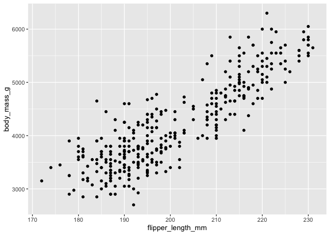
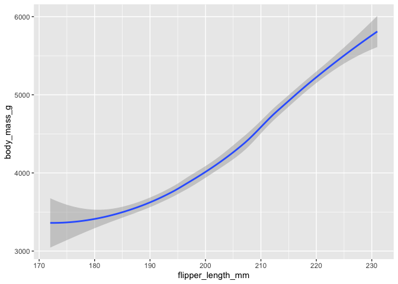
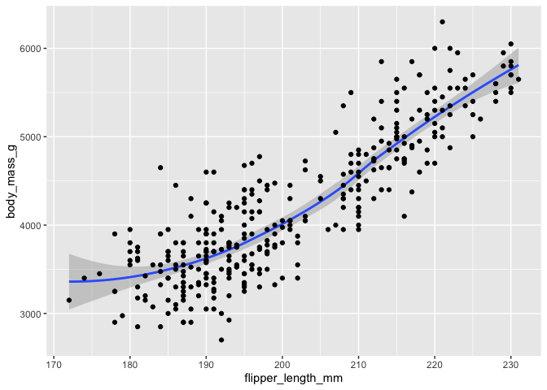
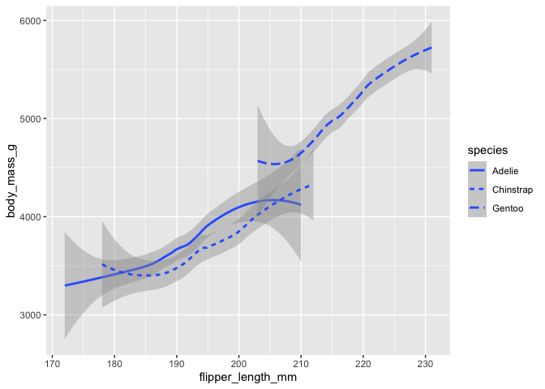
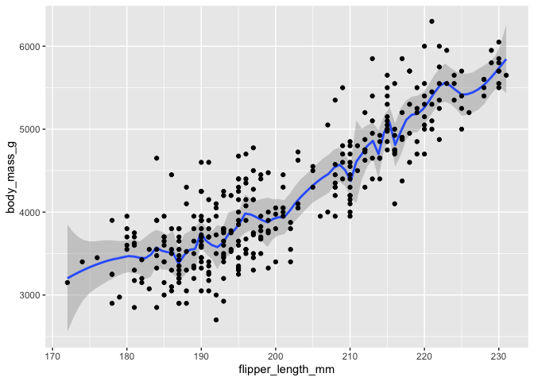
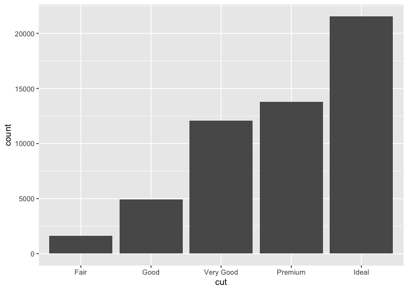
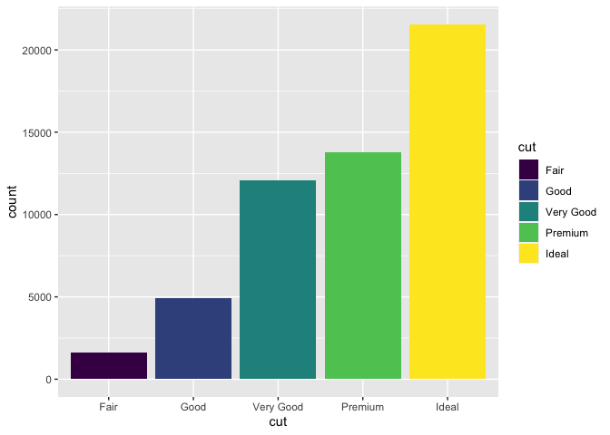
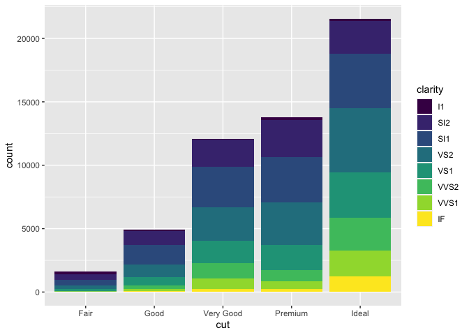

Utilizando diferentes geom()
================
Carlos Guadián

## Utilizando diferentes geoms

La función geom() nos facilitará hacer diferentes gráficos. De puntos,
barras, líneas…

Para cambiar el gráfico sólo tendremos que cambiar el geom().

Vamos a hacer una prueba con el dataset penguins.

``` r
library("ggplot2")
library("palmerpenguins")
data("penguins")
```

Primero vamos a reproducir el scatterplot que ya habíamos hecho
anteriormente.

``` r
ggplot(data = penguins) + geom_point(mapping = aes(x = flipper_length_mm, y = body_mass_g))
```

    ## Warning: Removed 2 rows containing missing values (geom_point).

<!-- -->

## SMOOTHING

Vamos a cambiar geom() y ver lo que ocurre.

``` r
ggplot(data = penguins) + geom_smooth(mapping = aes(x = flipper_length_mm, y = body_mass_g))
```

    ## `geom_smooth()` using method = 'loess' and formula 'y ~ x'

    ## Warning: Removed 2 rows containing non-finite values (stat_smooth).

<!-- -->

A pesar que son los mismos datos, ya no tenemos un conjunto de puntos,
tenemos una línea que nos muestra la tendencia general de los datos,
ofreciendo otra perspectiva diferente.

El uso de un geom() no excluye el uso de otro simultáneamente. Por
ejemplo, podemos utilizar geom\_point y geom\_smooth para visualizar más
claro la correlación y la tendencia de los datos.

``` r
ggplot(data = penguins) + geom_smooth(mapping = aes(x = flipper_length_mm, y = body_mass_g)) + geom_point(mapping = aes(x = flipper_length_mm, y = body_mass_g))
```

    ## `geom_smooth()` using method = 'loess' and formula 'y ~ x'

    ## Warning: Removed 2 rows containing non-finite values (stat_smooth).

    ## Warning: Removed 2 rows containing missing values (geom_point).

<!-- -->

Con geom\_smooth() también podemos aplicar diferentes líneas en base a
una variable con diferentes categorías, por ejemplo a las especies para
diferenciarlas unas de otras y ver las diferentes tendencias.

``` r
ggplot(data = penguins) + geom_smooth(mapping = aes(x = flipper_length_mm, y = body_mass_g, linetype = species))
```

    ## `geom_smooth()` using method = 'loess' and formula 'y ~ x'

    ## Warning: Removed 2 rows containing non-finite values (stat_smooth).

<!-- -->

A geom\_smooth() se le pueden aplicar dos métodos para sacar el máximo
partido a su visualización. Para menos de 1000 puntos podemos aplicar
“method =”loess“, y para gráficos mayores”method = “gam”.

Otro elemento que podemos cambiar es la anchura de las barras de
confidencia (la banda gris que acompaña la línea de tendencia). Lo
haremos con “span” y puede variar de 0 a 1. Cuanto más pequeña, más
ancha.

``` r
ggplot(data = penguins) + geom_smooth(mapping = aes(x = flipper_length_mm, y = body_mass_g), span = 0.1)  + geom_point(mapping = aes(x = flipper_length_mm, y = body_mass_g))
```

    ## `geom_smooth()` using method = 'loess' and formula 'y ~ x'

    ## Warning: Removed 2 rows containing non-finite values (stat_smooth).

    ## Warning in simpleLoess(y, x, w, span, degree = degree, parametric =
    ## parametric, : pseudoinverse used at 190

    ## Warning in simpleLoess(y, x, w, span, degree = degree, parametric =
    ## parametric, : neighborhood radius 1

    ## Warning in simpleLoess(y, x, w, span, degree = degree, parametric =
    ## parametric, : reciprocal condition number 0

    ## Warning in simpleLoess(y, x, w, span, degree = degree, parametric =
    ## parametric, : There are other near singularities as well. 1

    ## Warning in predLoess(object$y, object$x, newx = if
    ## (is.null(newdata)) object$x else if (is.data.frame(newdata))
    ## as.matrix(model.frame(delete.response(terms(object)), : pseudoinverse used at
    ## 190

    ## Warning in predLoess(object$y, object$x, newx = if
    ## (is.null(newdata)) object$x else if (is.data.frame(newdata))
    ## as.matrix(model.frame(delete.response(terms(object)), : neighborhood radius 1

    ## Warning in predLoess(object$y, object$x, newx = if
    ## (is.null(newdata)) object$x else if (is.data.frame(newdata))
    ## as.matrix(model.frame(delete.response(terms(object)), : reciprocal condition
    ## number 0

    ## Warning in predLoess(object$y, object$x, newx = if
    ## (is.null(newdata)) object$x else if (is.data.frame(newdata))
    ## as.matrix(model.frame(delete.response(terms(object)), : There are other near
    ## singularities as well. 1

    ## Warning: Removed 2 rows containing missing values (geom_point).

<!-- -->

## JITTER

Otro geom() interesante es geom\_jitter() que se suele utilizar en
scatterplots en los que hay muchos puntos para facilitar su lectura.

``` r
ggplot(data = penguins) + geom_jitter(mapping = aes(x = flipper_length_mm, y = body_mass_g))
```

    ## Warning: Removed 2 rows containing missing values (geom_point).

<!-- -->

## BARRAS

Vamos a utilizar ahora geom\_bar() para hacer un gráfico de barras.
Usaremos el dataset “diamonds” que viene incorporado con ggplot2()

``` r
ggplot(data = diamonds) + geom_bar(mapping = aes(x = cut))
```

<!-- -->

Podemos añadir otros elementos como un color asociado a una categoría.

``` r
ggplot(data = diamonds) + geom_bar(mapping = aes(x = cut, fill = cut))
```

<!-- -->

Y podemos hacer las combinaciones que queramos. Por ejemplo, asocial el
color de relleno de las barras a otra categoría como “clarity” para ver
la composición en cada categoría de “cut”. De esta manera conseguimos
una gráfico de barras apiladas.

``` r
ggplot(data = diamonds) + geom_bar(mapping = aes(x = cut, fill = clarity))
```

<!-- -->
