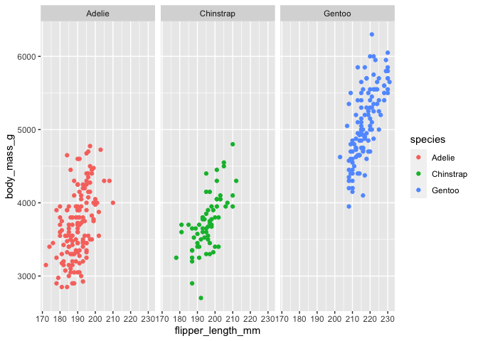
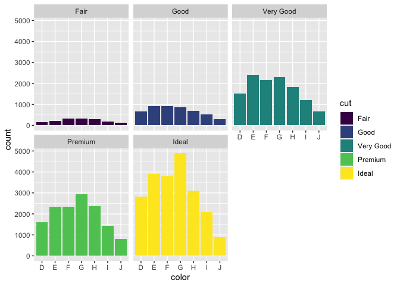
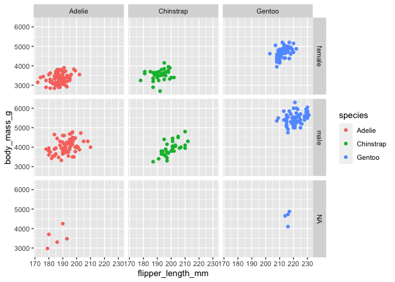
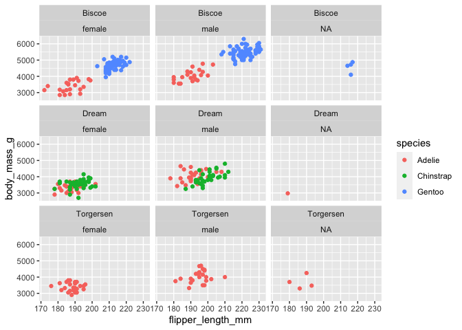

Facet Functions
================

``` r
library("ggplot2")
library("palmerpenguins")
data("penguins")
```

## Facets

Con “facets” podemos mostrar grupos más pequeños o secciones de un grupo
de datos, por ejemplo por los diferentes factores de una variable.

Tenemos dos tipos:

-   facet\_wrap() para utilizar con una sola variable.
-   facet\_grid()

## facet\_wrap()

Vamos a dividir el scatterplot de los pingüinos y generar uno para cada
especie.

``` r
ggplot(data = penguins) + geom_point(mapping = aes(x = flipper_length_mm, y = body_mass_g, color = species)) + facet_wrap(~species)
```

    ## Warning: Removed 2 rows containing missing values (geom_point).

<!-- -->

Vamos a probar ahora con “diamonds” y generar un gráfico para grupo de
“cut”.

``` r
ggplot(data = diamonds) + geom_bar(mapping = aes(x = color, fill = cut)) + facet_wrap(~cut)
```

<!-- -->

## facet\_grid()

Utilizaremos facet\_grid() cuando queramos utilizar más de una variable.
Por ejemplo para generar gráficos de los pingüinos por especie y sexo.

``` r
ggplot(data = penguins) + geom_point(mapping = aes(x = flipper_length_mm, y = body_mass_g, color = species)) + facet_grid(sex~species)
```

    ## Warning: Removed 2 rows containing missing values (geom_point).

<!-- -->

O por isla y sexo…

``` r
ggplot(data = penguins) + geom_point(mapping = aes(x = flipper_length_mm, y = body_mass_g, color = species)) + facet_wrap(island~sex)
```

    ## Warning: Removed 2 rows containing missing values (geom_point).

<!-- -->
