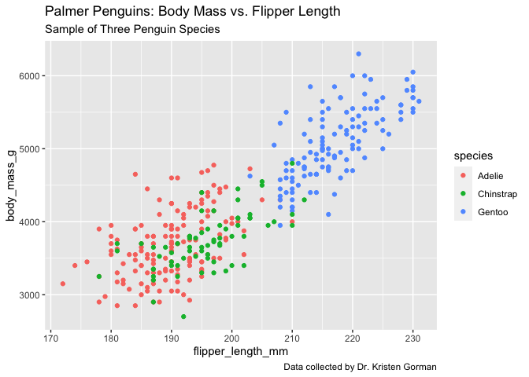
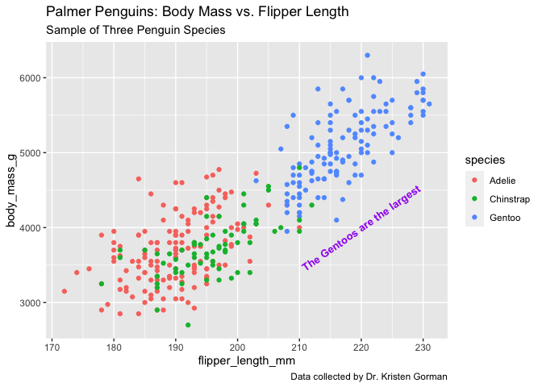
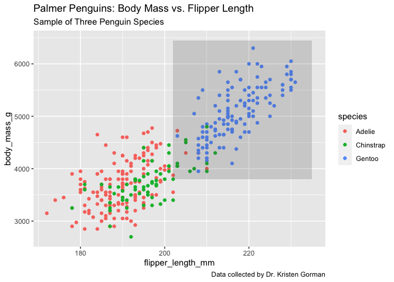
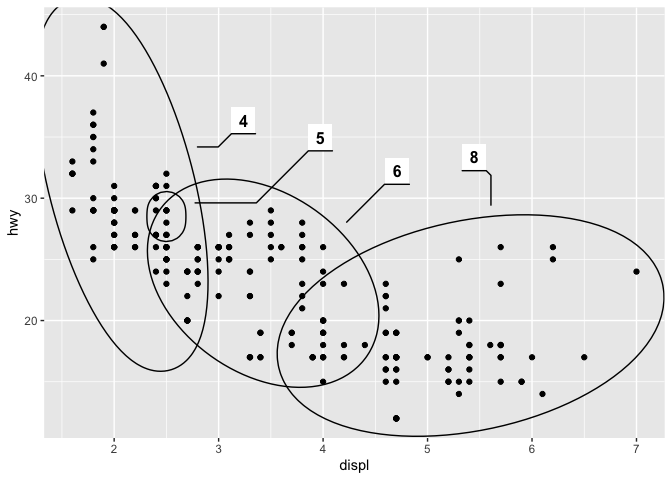

Anotaciones en el gráfico
================
Carlos Guadián

``` r
library("ggplot2")
library("palmerpenguins")
data("penguins")
#install.packages("ggforce")
library(ggforce)
```

## Tipos de anotaciones en un gráfico

A un gráfico además de las etiquetas de los datos se le puede añadir una
capa de texto con información extra. Se pueden añadir los siguientes
elementos:

-   Títulos
-   Subtítulos
-   Leyendas

Por ejemplo podemos añadir un título y un subtítulo al scatterplot de
los pingüinos para indicar específicamente el objeto del gráfico. Así
como una leyenda (con caption) para indicar el origen de los datos.

``` r
ggplot(data = penguins) + geom_point(mapping = aes(x = flipper_length_mm, y = body_mass_g, color = species)) + labs(title = "Palmer Penguins: Body Mass vs. Flipper Length", subtitle = "Sample of Three Penguin Species", caption = "Data collected by Dr. Kristen Gorman")
```

    ## Warning: Removed 2 rows containing missing values (geom_point).

<!-- -->

## Anotaciones en el gráfico respecto de los datos

Para incluir etiquetas en puntos de datos específicos utilizaremos la
función annotate() en la que indicaremos el tipo de etiqueta que es, su
posición y el texto de la etiqueta.

Más info sobre annotate():
<https://ggplot2.tidyverse.org/reference/annotate.html>

En este caso añadiremos una etiqueta al gráfico en una posición próxima
a los puntos de datos de la especie Gentoo para indicar que son los más
largos. El texto de la etiqueta por supuesto que lo podemos modificar
para darle más visibilidad, como ponerlo de color púrpura, ponerla en
negrita o modificar su tamaño. Incluso modificar el ángulo de escritura.

``` r
ggplot(data = penguins) + geom_point(mapping = aes(x = flipper_length_mm, y = body_mass_g, color = species)) + labs(title = "Palmer Penguins: Body Mass vs. Flipper Length", subtitle = "Sample of Three Penguin Species", caption = "Data collected by Dr. Kristen Gorman") + annotate("text", x = 220, y = 4000, label = "The Gentoos are the largest", color = "purple", fontface = "bold", size = 3.5, angle = 35)
```

    ## Warning: Removed 2 rows containing missing values (geom_point).

<!-- -->

Con annotate() también podemos resaltar una zona del gráfico en lugar de
incorporar un texto. Vamos a marcar la zona de los pingüinos Gentoo.

``` r
ggplot(data = penguins) + geom_point(mapping = aes(x = flipper_length_mm, y = body_mass_g, color = species)) + labs(title = "Palmer Penguins: Body Mass vs. Flipper Length", subtitle = "Sample of Three Penguin Species", caption = "Data collected by Dr. Kristen Gorman") + annotate("rect", xmin = 202,xmax = 235, ymin = 3800, ymax = 6450, alpha = .2)
```

    ## Warning: Removed 2 rows containing missing values (geom_point).

<!-- --> Las
formas se pueden usar para señalar grupos de datos como hemos visto en
el anterior gráfico. Pero podemos hacer algo más dinámico y que ggplot()
marque los grupos por nosotros, para ello utilizaremos el paquete
ggforce().

``` r
ggplot(mpg, aes(displ, hwy)) +
  geom_point() + 
  ggforce::geom_mark_ellipse(aes(label = cyl, group = cyl))
```

<!-- -->

## Guardar el gráfico como una variable

Para que el chunk de código para el gráfico no sea tan largo, podemos
guardarlo como una variable e ir añadiendo lo que necesitemos.

``` r
p <- ggplot(data = penguins) + geom_point(mapping = aes(x = flipper_length_mm, y = body_mass_g, color = species)) + labs(title = "Palmer Penguins: Body Mass vs. Flipper Length", subtitle = "Sample of Three Penguin Species", caption = "Data collected by Dr. Kristen Gorman")

# Ahora podemos añadir annotate a la variable p

 p + annotate("text", x = 220, y = 4000, label = "The Gentoos are the largest", color = "purple", fontface = "bold", size = 3.5, angle = 35)
```

    ## Warning: Removed 2 rows containing missing values (geom_point).

<!-- -->

## Más recursos sobre el tema

-   [Crear una capa de
    anotación](https://ggplot2.tidyverse.org/reference/annotate.html):
    Esta guía explica cómo añadir una capa de anotaciones con ggplot2.
    Incluye código de ejemplo y visualizaciones de datos con anotaciones
    creadas en ggplot2.

-   [Cómo anotar un gráfico en
    ggplot2](https://www.r-graph-gallery.com/233-add-annotations-on-ggplot2-chart.html):
    Este recurso incluye explicaciones sobre cómo añadir diferentes
    tipos de anotaciones a tus gráficos de ggplot2, y es una gran
    referencia si necesitas buscar rápidamente un tipo específico de
    anotación.

-   [Anotaciones](https://ggplot2-book.org/annotations.html): El
    capítulo ocho del libro de texto online de ggplot2 se centra por
    completo en las anotaciones. Proporciona explicaciones en
    profundidad de los diferentes tipos de anotaciones, cómo se
    utilizan, y ejemplos detallados.

-   [Cómo anotar un
    gráfico](https://www.r-bloggers.com/2017/02/how-to-annotate-a-plot-in-ggplot2/):
    Este artículo de R-Bloggers incluye explicaciones sobre cómo anotar
    gráficos en ggplot2. Comienza con conceptos básicos y cubre
    información más complicada a medida que se avanza en la lectura.

-   [Anotaciones de
    texto](https://viz-ggplot2.rsquaredacademy.com/textann.html): Este
    recurso se centra específicamente en añadir anotaciones de texto y
    etiquetas a las visualizaciones de ggplot2.
